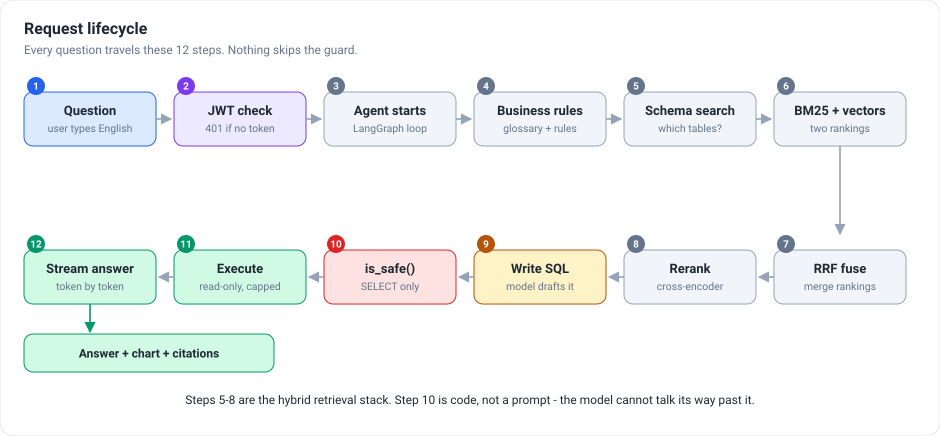
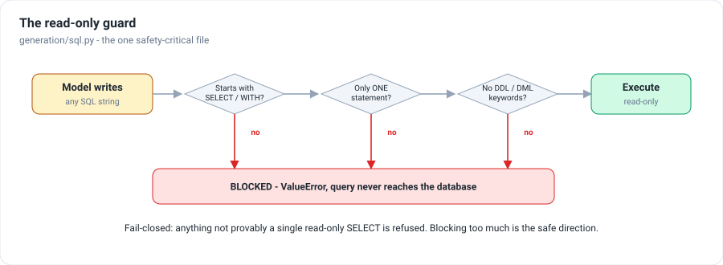
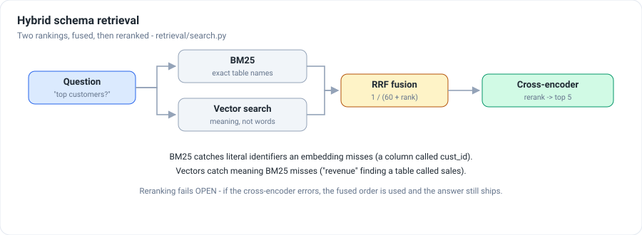
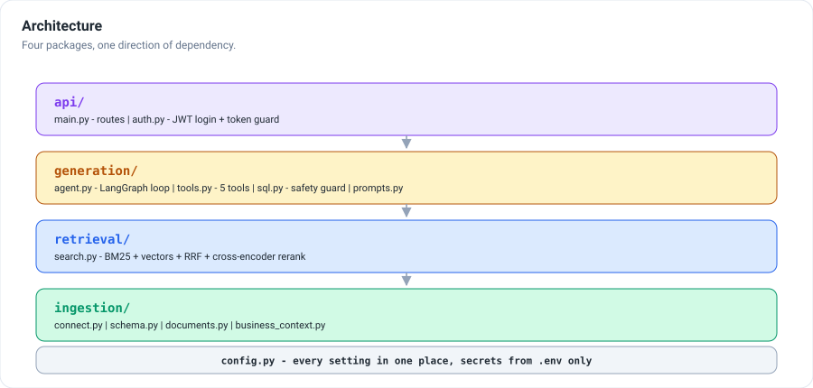

<h1 align="center">Text-to-SQL Agent</h1>

<p align="center">
  <b>Ask your company's database a question in normal English. Get a straight answer.</b><br>
  No spreadsheets, no waiting for the data team — and it can only ever read your data,
  never change or delete it.
</p>

<p align="center">
  
  
  
  
  
</p>

---

## What is this

Company information lives in databases, and getting anything out of one normally means
writing a special instruction that almost nobody outside a technical team can write. So a
manager who wants to know *"how many orders arrived late last month?"* has to ask someone
else, and wait.

This removes the waiting. You type the question the way you would say it. The assistant
works out where the answer lives, fetches it, and replies in plain English. You can also
upload documents — a policy PDF, a spreadsheet — and ask about those the same way.

---

## Why this is different from pointing ChatGPT at your data

The moment a program can write its own database instructions, **an instruction that can
read your data can also delete it.**

Most demos handle this by politely asking the AI not to. That is a request, not a
safeguard — requests can be ignored, tricked, or misunderstood.

Here, every instruction is checked by a separate part of the system **that the AI has no
control over**. Anything other than a simple read is thrown away and never runs.

---

## What happens when you ask a question



```
You ask a question
  → Check you are allowed in        no login, no access
  → The assistant wakes up          and starts on your question
  → It reads your own terms         so "revenue" means what YOU mean by it
  → It works out where to look      which parts of your data could hold the answer
  → It searches two ways            once by keyword, once by meaning
  → It combines both results        into one better list
  → It keeps the best few           the most likely places
  → It drafts a request             to fetch exactly what is needed
  → SAFETY CHECK                    read-only, or the request is thrown away
  → It fetches the information      reading only, never changing
  → It writes the reply             in plain English, word by word
→ Your answer, and where it came from
```

Twelve steps, every time. The safety check cannot be skipped.

---

## What you can do

| | |
|---|---|
| **Ask about your data** | *"Which five customers spent the most last year?"* |
| **Ask about your documents** | Upload a policy, report or spreadsheet, then ask about it |
| **Teach it your words** | A glossary of your own terms — see below |
| **Follow-up questions** | It remembers, so *"and the year before?"* works |
| **See the source** | Every answer names the file or table behind it |
| **Stay safe** | Reading only, always. Your database password is never saved |

---

## Teach it your words

Every company uses words differently. "Revenue" might mean gross to one team and net of
refunds to another, and the assistant has no way to guess which you meant.

So you tell it. Open the **Your words** panel and type one entry per line:

```
revenue = net amount after refunds, not gross
active customer = someone who ordered in the last 90 days
churn = a customer with no order for 6 months

rule: always exclude cancelled orders
rule: never show individual customer names in totals
note: the financial year starts in April
```

Three kinds of entry, and they do different jobs:

| You write | It means |
|---|---|
| `term = meaning` | A word your company uses, and what it actually refers to |
| `rule: …` | Something the assistant must always or never do |
| `note: …` | Background it should know about your business |

You can paste this in, or upload it as a text file. The assistant reads it **before every
single answer**, so a correction takes effect immediately.

> Right now this is kept in memory, so it clears when the server restarts. Saving it
> permanently is a small change and is on the list below.

---

## The safety check

Every request has to pass three questions before it is allowed to run.



This check is part of the program, not an instruction given to the AI — so it cannot be
argued with, rephrased around, or skipped. When there is any doubt, the answer is no.

---

## How it finds the right information

Imagine a filing cabinet with two hundred drawers. Before answering, the assistant has to
work out which five to open.



It searches **by keyword** (good when you use the same word the data uses) and **by
meaning** (good when you don't — asking about "revenue" when the data says "sales"). Each
method misses what the other catches, so both run and the results are combined.

---

## How the parts fit together



---

## Setting it up

**Step 1 — download and install**

```bash
git clone https://github.com/bharatsoni0047/text-to-sql-agent.git
cd text-to-sql-agent
python -m venv .venv
.venv\Scripts\activate                 # Mac or Linux: source .venv/bin/activate
pip install -r requirements.txt
```

**Step 2 — add your settings**

```bash
cp .env.example .env
```

Then fill in four things:

```ini
OPENAI_API_KEY=your-key-here
JWT_SECRET=any-long-random-string
APP_USERNAME=admin
APP_PASSWORD=choose-a-strong-password
```

Need a random string? `python -c "import secrets; print(secrets.token_urlsafe(48))"`

> Leaving the last three blank turns the login off. Fine while testing on your own
> computer, never for anything other people can reach.

**Step 3 — start it**

```bash
uvicorn api.main:app --reload
```

Open **http://127.0.0.1:8000**.

**Step 4 — log in and connect your database**

Use the username and password you chose, then enter your database details. **These are
never saved to disk** — they live only while the program is running.

**Step 5 — teach it your words** *(optional but worth it)*

Open **Your words** and paste in your glossary.

**Step 6 — ask something**

Type a question in normal English and press Enter.

---

## Docker

```bash
docker build -t text-to-sql-agent .
docker run -p 8000:8000 --env-file .env text-to-sql-agent
```

---

## For developers

<details>
<summary>Technical details — click to expand</summary>

**Stack:** Python 3.11 · FastAPI · LangGraph · LangChain · Chroma · BGE embeddings ·
flashrank cross-encoder · rank-bm25 · SQLAlchemy · python-jose (JWT)

**Size:** ~570 lines of Python across 16 files.

**The guard** (`generation/sql.py`):

```python
def is_safe(sql_query):
  cleaned = sql_query.strip().rstrip(";").upper()
  if ";" in cleaned:                              # a second statement
    return False
  if not cleaned.startswith(("SELECT", "WITH")):  # not a read
    return False
  return not re.search(FORBIDDEN_WORDS, cleaned)  # DDL / DML / EXEC
```

Whitelist first, blacklist second, fail-closed, and called by `execute_sql()` itself rather
than by its callers — so there is no unguarded path to the database.

**Retrieval:** BM25 and vector rankings fused with reciprocal rank fusion (`1/(60+rank)`),
then reranked by a cross-encoder. RRF works on rank rather than score, so two incomparable
scales never need calibrating. The reranker fails **open**; the guard fails **closed** —
deliberately opposite, because one is a quality optimisation and the other is a safety
property.

**Agent:** a LangGraph tool-calling loop with five tools (`get_schema`, `run_sql`,
`find_table`, `search_documents`, `get_business_context`), sequenced by the model itself.
A failed query is retried once using the database's own error message.

**Business context** (`ingestion/business_context.py`): `parse_text()` accepts three line
shapes (`term = meaning`, `rule:`, `note:`) and `replace()` swaps the whole set atomically.
`get_business_context_text()` is called on every turn, so edits apply to the next question
with no restart.

**API:**

| Route | Auth | Purpose |
|---|---|---|
| `POST /login` | — | Credentials in, bearer token out |
| `POST /connect` | token | Connect a database and index its schema |
| `POST /chat` | token | Ask a question, answer streams back |
| `POST /upload` | token | Add a PDF / DOCX / XLSX / TXT file |
| `GET /context` | — | Current glossary, rules and notes |
| `POST /context` | token | Replace them from a block of text |
| `POST /context/upload` | token | Replace them from an uploaded file |
| `GET /status` | — | What is connected and indexed |

</details>

---

## Honest limitations

- **Your glossary and uploaded documents clear when the program restarts.** Both are held
  in memory. Saving them to disk is the next thing to add.
- **One long answer can hold up other people's questions.** Fine for a small team.
- **Searching slows down with very many documents.** Fine for hundreds, slow for tens of
  thousands.
- **One login for everyone.** No separate accounts or permission levels yet.
- **The safety check has no automated test yet.** It is the most important piece here, and
  proving it works automatically is the highest-value next task.

---

## The story behind this project

The problem, the decisions and the trade-offs are written up in **[STAR.md](STAR.md)**.
